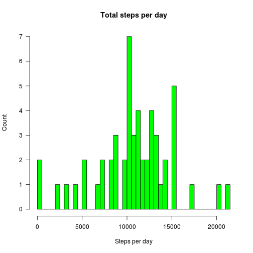
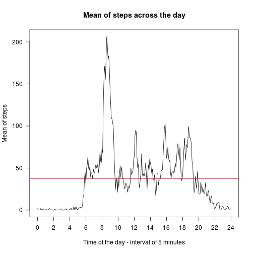
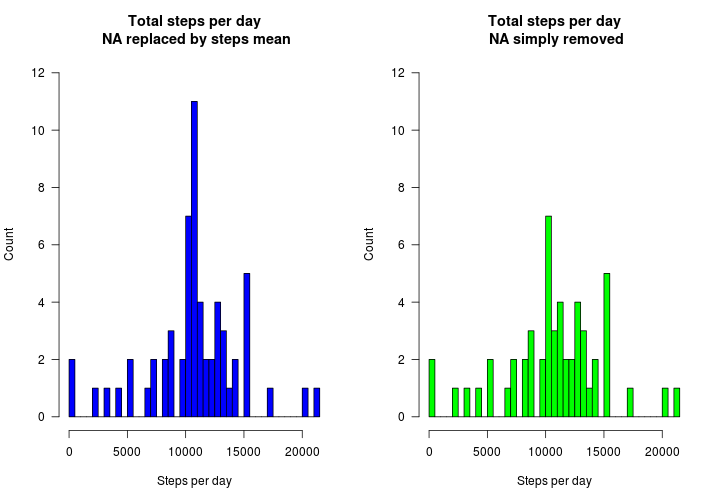
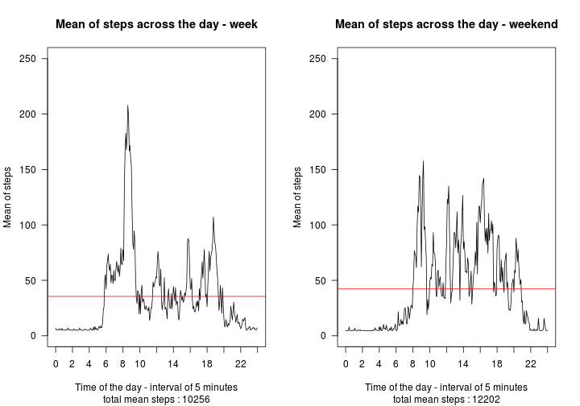

# ACTIVITY MONITORING ASSIGNMENT
by Bruno Berrehuel - 17th July 2016 

------------------------

First, download and unzip file provided by the Coursera Assignment, store the datas in variable called activity, then it'll be processed to answer each  question

```r
if (!file.exists("data_activity.zip")){ 
    download.file("https://d396qusza40orc.cloudfront.net/repdata%2Fdata%2Factivity.zip",
                  destfile="data_activity.zip")
}
unzip("data_activity.zip")
activity  <- read.csv("activity.csv")
dim(activity)
```

```
## [1] 17568     3
```

```r
summary(activity)
```

```
##      steps                date          interval     
##  Min.   :  0.00   2012-10-01:  288   Min.   :   0.0  
##  1st Qu.:  0.00   2012-10-02:  288   1st Qu.: 588.8  
##  Median :  0.00   2012-10-03:  288   Median :1177.5  
##  Mean   : 37.38   2012-10-04:  288   Mean   :1177.5  
##  3rd Qu.: 12.00   2012-10-05:  288   3rd Qu.:1766.2  
##  Max.   :806.00   2012-10-06:  288   Max.   :2355.0  
##  NA's   :2304     (Other)   :15840
```

------------------------

## What is mean total number of steps taken per day ?
Remove missing values from activity, then calculate total steps per date and using dplyr package

```r
library(dplyr)
```

```
## 
## Attaching package: 'dplyr'
```

```
## The following objects are masked from 'package:stats':
## 
##     filter, lag
```

```
## The following objects are masked from 'package:base':
## 
##     intersect, setdiff, setequal, union
```


```r
activityWoNA <- na.omit(activity)
totalStepsWoNA <- activityWoNA %>% group_by(date) %>% summarize(sum(steps))
names(totalStepsWoNA) <- c("names","steps")
```

Plot the results with baseplot to limit external library

```r
hist(totalStepsWoNA$steps, breaks=75, col="green", las=1,
     main="Total steps per day",
     xlab="Steps per day",
     ylab="Count")
```



### Conclusions :

Most of steps count are between 8000 - 15 000 steps, which is confirmed by the *mean*, the  *median* and the quantiles of total steps per days :  

```r
summary(totalStepsWoNA$steps)
```

```
##    Min. 1st Qu.  Median    Mean 3rd Qu.    Max. 
##      41    8841   10760   10770   13290   21190
```

------------------------

## What is the average daily activity pattern ?

Calculate the average number of steps taken every 5 minutes across the days : group the activity variable by interval, calculate the mean of the steps for each interval

```r
minuteSteps <- activityWoNA %>% group_by(interval) %>% summarize(mean(steps))
names(minuteSteps) <- c("interval", "meanSteps")
summary(minuteSteps$meanSteps)
```

```
##    Min. 1st Qu.  Median    Mean 3rd Qu.    Max. 
##   0.000   2.486  34.110  37.380  52.830 206.200
```

Plot the result in a time series of the 5-minutes interval : ploting for 24 hours, with an interval of 5 minutes, so 12 observations by hour.  

```r
ts <- ts(minuteSteps$meanSteps, start=0, end=24, frequency=12)
plot.ts(ts, main="Mean of steps across the day",
        xlab="Time of the day - interval of 5 minutes",
        ylab="Mean of steps",
        las=1, xaxp=c(0,24,12))
abline(h=mean(minuteSteps$meanSteps), col="red")
```



Find which interval containing the max number of steps, by using the which.max function on steps stored in minuteSteps, and using paste to format answer and put it inline :

```r
maxStep <- minuteSteps$interval[which.max(minuteSteps$meanSteps)]
maxStep <- sprintf("%04d",maxStep)
maxStep <- paste(substr(maxStep,1,2),substr(maxStep,3,4),sep=":")
```

The interval which contains the maximum number of steps is **08:35**.

### Conclusions - identification of pattern :

1. Step count is significant between 6 AM and 10 PM
1. few steps/minute at night when people are sleeping (what a scoop ;-))
2. many steps/minute between 8 and 10 o'clock, maybe for sports ?
3. some steps/minute at 12 o'clock for lunch and at the evening for afterwork activities

------------------------

## Imputing missing values

Calculate the total number of missing values, absolute and relative :

```r
totalNA <- sum(is.na(activity))
relativeNA <- ceiling(sum(is.na(activity))/dim(activity)[1]*100)
```

There are **2304** missing values, which represent **14 %** of total values.  
*Strategy for missing values* : they will be replaced by the mean of the non-missing values, so the steps mean of activityWoNA :

```r
activity[is.na(activity)] <- mean(activityWoNA$steps)
sum(is.na(activity))
```

```
## [1] 0
```

```r
dim(activity)
```

```
## [1] 17568     3
```

```r
summary(activity)
```

```
##      steps                date          interval     
##  Min.   :  0.00   2012-10-01:  288   Min.   :   0.0  
##  1st Qu.:  0.00   2012-10-02:  288   1st Qu.: 588.8  
##  Median :  0.00   2012-10-03:  288   Median :1177.5  
##  Mean   : 37.38   2012-10-04:  288   Mean   :1177.5  
##  3rd Qu.: 37.38   2012-10-05:  288   3rd Qu.:1766.2  
##  Max.   :806.00   2012-10-06:  288   Max.   :2355.0  
##                   (Other)   :15840
```

The new dataset "activity" has no missing value, the same dimensions and steps mean.

Plot histogram of total steps taken each day and compare with plot of removed NA :

```r
totalSteps <- activity %>% group_by(date) %>% summarize(sum(steps))
names(totalSteps) <- c("names","steps")
par(mfrow=c(1,2))
hist(totalSteps$steps, breaks=75, col="blue", las=1,
     main="Total steps per day\n NA replaced by steps mean",
     xlab="Steps per day",
     ylab="Count",
     ylim=c(0,12))

hist(totalStepsWoNA$steps, breaks=75, col="green", las=1,
     main="Total steps per day\n NA simply removed",
     xlab="Steps per day",
     ylab="Count",
     ylim=c(0,12))
```



Take a look at the mean and the median too :

```r
summary(totalSteps$steps)
```

```
##    Min. 1st Qu.  Median    Mean 3rd Qu.    Max. 
##      41    9819   10770   10770   12810   21190
```

```r
summary(totalStepsWoNA$steps)
```

```
##    Min. 1st Qu.  Median    Mean 3rd Qu.    Max. 
##      41    8841   10760   10770   13290   21190
```

### Conclusions :
1. Replace NA with mean change a little bit the histogram profil, to be sharper
2. Replace NA with mean change the *quantiles* and the *median*, but not change the min, max and mean values.

------------------------

## Are there differences in activity patterns between weekdays and weekends ?

Create a column of days from date by using "weekdays" function, then filter the data for weekdays and for weekend, and check the results :

```r
weekdays <- activity %>% mutate(days=weekdays(as.Date(activity$date)))
weekend  <- weekdays %>% filter(days=="samedi" | days=="dimanche")
week  <- weekdays %>% filter(days!="samedi" & days!="dimanche")
```

Check the result of previous variables :

```r
table(week$days)
```

```
## 
##    jeudi    lundi    mardi mercredi vendredi 
##     2592     2592     2592     2592     2592
```

```r
table(weekend$days)
```

```
## 
## dimanche   samedi 
##     2304     2304
```

Calculate the average number of steps taken every 5 minutes across the days : group the variables by interval, calculate the mean of the steps for each interval

```r
minuteWeek <- week %>% group_by(interval) %>% summarize(mean(steps))
names(minuteWeek) <- c("interval", "meanSteps")
minuteWeekend <- weekend %>% group_by(interval) %>% summarize(mean(steps))
names(minuteWeekend) <- c("interval", "meanSteps")
```

Calculate the total amount of mean steps for week and for weekend :

```r
totalWeek <- ceiling(sum(minuteWeek$meanSteps))
totalWeekend <- ceiling(sum(minuteWeekend$meanSteps))
```

Finally plot the minuteWeek and minuteWeekend : ploting for 24 hours, with an interval of 5 minutes, so 12 observations by hour, including the total steps amount previously calculated.  

```r
tsWeek <- ts(minuteWeek$meanSteps, start=0, end=24, frequency=12)
tsWeekend <- ts(minuteWeekend$meanSteps, start=0, end=24, frequency=12)

par(mfrow=c(1,2))
plot.ts(tsWeek, main="Mean of steps across the day - week",
        sub=paste("total mean steps :",totalWeek),
        xlab="Time of the day - interval of 5 minutes",
        ylab="Mean of steps",
        ylim=c(0,250),
        las=1, xaxp=c(0,24,12))
abline(h=mean(tsWeek), col="red")

plot.ts(tsWeekend, main="Mean of steps across the day - weekend",
        sub=paste("total mean steps :", totalWeekend),
        xlab="Time of the day - interval of 5 minutes",
        ylab="Mean of steps",
        ylim=c(0,250),
        las=1, xaxp=c(0,24,12))
abline(h=mean(tsWeekend), col="red")
```



### Conclusions :

The pattern is different between weekdays and weekends :

1. There are more steps for weekends than for weekdays
2. Step count is significant between 8 AM and 10 PM for weekends
2. Step count is significant between 6 AM and 10 PM for weekdays
4. Steps are more regular across the day for weekends than for weekdays
